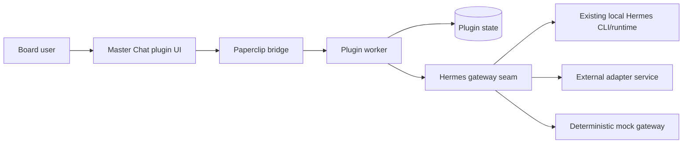

# Paperclip Master Chat Plugin

A standalone **Paperclip plugin** that adds a plugin-owned **Master Chat** surface backed by **Hermes**.

The plugin is intentionally aligned with Paperclip's current product boundary: Paperclip core remains a control plane, while rich conversational UX lives in a plugin. This repo packages the worker, UI, Hermes gateway seam, tests, and documentation needed to develop and ship that plugin as a standalone project.

## What ships in this repo

- **Plugin worker** with scoped thread actions, retry-safe assistant continuation, attachment validation, typed error mapping, and in-flight protection
- **Paperclip-native UI** with a thread rail, scoped context controls, inline image attachments, live stream rendering, warning surfaces, dashboard widget, sidebar entry, and issue detail tab
- **Hermes integration seam** with:
  - true `auto` detection that probes local CLI availability before falling back
  - a deterministic `mock` gateway for local development/tests
  - an `http` gateway mode for an external Hermes adapter service with required auth headers
  - a `cli` mode for explicitly shelling out to the local Hermes binary
- **Plugin-owned thread store** persisted via Paperclip plugin state, now versioned for migration safety
- **Typed multimodal payload builder** that converts message history into Hermes-friendly content blocks
- **Docs** for architecture, configuration, integration, security, VPS reuse, and the repo improvement roadmap
- **Tests + CI** for payload transformation, CLI prompt building, gateway selection, worker behavior, and UI helpers

## Architecture summary



### Current alpha/runtime reality

Paperclip's current plugin runtime does **not** expose a stable `ctx.assets` API. To keep the plugin functional today, this repo ships **inline image attachment support** (via browser `FileReader` data URLs) and documents how to migrate to Paperclip asset persistence once the host runtime exposes that capability.

## Features

- Company-scoped thread list and chat page
- Project / issue / agent scope selection with scope validation against company-scoped records
- Skill toggles and Hermes toolset policy alignment
- Inline image previews plus attachment count/type/size enforcement
- Retry-safe assistant continuation that does **not** duplicate the user turn
- Live stream text/status rendering instead of raw JSON
- Activity logging + metric emission on successful sends and typed error metrics on failures
- Dashboard widget and issue detail entry point
- VPS-aware reuse of an existing `hermes` install when available

## Quick start

### 1) Install

```bash
pnpm install
```

### 2) Verify

```bash
pnpm verify
pnpm audit:prod
```

### 3) Check local VPS reuse options

```bash
pnpm vps:check
```

On this VPS, the script detects whether:
- `hermes` is already installed and runnable
- `/root/hermes-agent` exists as a local Hermes checkout
- `/root/work/paperclip` exists as a local Paperclip checkout
- local Hermes ports such as `8787` or `8642` are listening

### 4) Build for Paperclip

```bash
pnpm build
```

Artifacts land in `dist/` and can be installed into a Paperclip instance as a local-path plugin during development.

## Configuration

The plugin exposes instance config fields through the Paperclip manifest schema, including:

- `gatewayMode`: `auto`, `mock`, `http`, or `cli`
- `hermesCommand`: command/path for the local Hermes CLI
- `hermesWorkingDirectory`: optional cwd for the local Hermes checkout/runtime
- `hermesBaseUrl`: base URL for an external Hermes adapter service when `gatewayMode=http`
- `hermesAuthToken` / `hermesAuthHeaderName`: service auth for the adapter boundary
- `gatewayRequestTimeoutMs`
- `defaultProfileId`
- `defaultProvider`
- `defaultModel`
- `defaultEnabledSkills`
- `defaultToolsets`
- `availablePluginTools`
- `maxHistoryMessages`
- `allowInlineImageData`
- `maxAttachmentCount`
- `maxAttachmentBytesPerFile`
- `maxTotalAttachmentBytes`
- `maxCatalogRecords`
- `scopePageSize`
- `redactToolPayloads`
- `enableActivityLogging`

See [`docs/configuration.md`](./docs/configuration.md).

## Hermes integration modes

### `gatewayMode=auto`

The worker probes the configured local Hermes CLI first. If that probe fails, it will try the authenticated HTTP adapter path; if neither is viable, it falls back to `mock` for explicit non-production/dev handling.

### `gatewayMode=cli`

Force local CLI execution even outside auto-detection. Useful when you want predictable host-local routing through the already installed Hermes profile and model setup.

### `gatewayMode=http`

Send normalized payloads to an external adapter service:

```text
POST {hermesBaseUrl}/sessions/continue
```

HTTP mode now **fails closed** unless adapter auth is configured.

### Session continuity semantics

- **HTTP mode** is the preferred production path for durable Hermes continuation.
- **CLI mode** resumes existing Hermes sessions with `--resume <sessionId>` when the thread already has a real session ID.
- **New CLI conversations** are treated as `stateless` until the integration can prove a durable Hermes session ID.

## Repository layout

```text
src/constants.ts          plugin IDs, routes, defaults
src/types.ts              shared domain and gateway types
src/errors.ts             typed runtime error helpers
src/domain/store.ts       plugin-owned state store helpers
src/paperclip/context.ts  Paperclip scope/bootstrap helpers
src/hermes/*              payload builder + CLI/HTTP gateway implementations
src/worker.ts             plugin worker
src/manifest.ts           plugin manifest
src/ui/*                  plugin React UI
tests/*                   payload + gateway + CLI + worker + UI helper tests
scripts/*                 VPS reuse detection helpers
.github/workflows/*       CI verification
```

## Contributor workflow

```bash
pnpm verify
pnpm audit:prod
pnpm repo:check
```

See [`CONTRIBUTING.md`](./CONTRIBUTING.md).

## Documentation

- [Architecture](./docs/architecture.md)
- [Configuration](./docs/configuration.md)
- [Integration](./docs/integration.md)
- [Security and caveats](./docs/security.md)
- [VPS reuse guide](./docs/vps-reuse.md)
- [Repository improvement PRD](./docs/prd-repo-improvements.md)

## Verification

```bash
pnpm typecheck
pnpm test
pnpm build
pnpm audit:prod
pnpm vps:check
```

## Status

This repository is production-oriented **plugin code**, but it is honest about current Paperclip alpha limitations. The worker/UI flow, thread state, Hermes reuse strategy, docs, CI, and tests are complete in this repo; production rollout still depends on the target Paperclip instance and whichever Hermes integration mode you enable.
