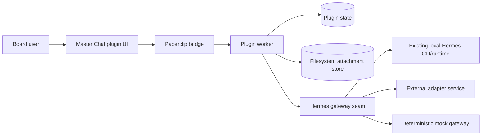

# Paperclip Master Chat Plugin

A standalone **Paperclip plugin** that adds a plugin-owned **Master Chat** surface backed by **Hermes**.

The plugin is intentionally aligned with Paperclip's current product boundary: Paperclip core remains a control plane, while rich conversational UX lives in a plugin. This repo packages the worker, UI, Hermes gateway seam, tests, and documentation needed to develop and ship that plugin as a standalone project.

## What ships in this repo

- **Plugin worker** with scoped thread actions, retry-safe assistant continuation, attachment validation, typed error mapping, and in-flight protection
- **Paperclip-native UI** with a thread rail, scoped context controls, image attachments, live stream rendering, warning surfaces, dashboard widget, sidebar entry, and issue detail tab
- **Hermes integration seam** with:
  - true `auto` detection that probes local CLI availability before falling back
  - a deterministic `mock` gateway for local development/tests
  - an `http` gateway mode for an external Hermes adapter service with required auth headers
  - a `cli` mode for explicitly shelling out to the local Hermes binary
  - a bundled local adapter service (`dist/adapter-service.js`) for authenticated host-local HTTP mediation with constant-time auth checks and bounded request bodies
- **Filesystem-backed attachment storage** with lazy hydration so plugin state no longer needs to persist large inline image blobs by default
- **Vision/OCR enrichment** that reuses Hermes itself to produce cached image summaries, extracted text, and safer text fallbacks for multimodal turns
- **Synthetic continuity snapshots** that summarize truncated thread history when Hermes durability is unavailable
- **Plugin-owned thread store** persisted via Paperclip plugin state, now versioned for migration safety
- **Typed multimodal payload builder** that converts message history into Hermes-friendly content blocks plus image-analysis text fallbacks
- **Docs** for architecture, configuration, integration, security, VPS reuse, and the repo improvement roadmap
- **Tests + CI** for payload transformation, CLI prompt building, gateway selection, worker behavior, and UI helpers

## Architecture summary



### Current alpha/runtime reality

Paperclip's current plugin runtime does **not** expose a stable `ctx.assets` API. To keep the plugin functional today, this repo persists images to a **host-local filesystem attachment store** by default, hydrates them lazily for UI/Hermes use, and documents how to migrate to Paperclip asset persistence once the host runtime exposes that capability.

## Features

- Company-scoped thread list and chat page
- Project / issue / agent scope selection with scope validation against company-scoped records
- Skill toggles and Hermes toolset policy alignment
- Filesystem-backed image persistence with lazy hydration plus attachment count/type/size enforcement and server-side byte recomputation from the actual data URL
- Hermes-powered vision/OCR analysis for images, including cached summaries, extracted text, and notable details rendered in the UI
- Message length enforcement with matching worker + UI validation
- Retry-safe assistant continuation that does **not** duplicate the user turn
- Synthetic continuity summaries when older thread history is truncated or Hermes does not provide durability
- Live stream text/status rendering instead of raw JSON
- Activity logging + metric emission on successful sends and typed error metrics on failures
- Dashboard widget and issue detail entry point
- VPS-aware reuse of an existing `hermes` install when available

## Quick start

### 1) Install

```bash
pnpm install
```

### 2) Verify

```bash
pnpm verify
pnpm audit:prod
```

### 3) Check local VPS reuse options

```bash
pnpm vps:check
pnpm vps:smoke
pnpm remote:smoke:local
```

On this VPS, the script detects whether:
- `hermes` is already installed and runnable
- `/root/hermes-agent` exists as a local Hermes checkout
- `/root/work/paperclip` exists as a local Paperclip checkout
- local Hermes ports such as `8787` or `8642` are listening

`pnpm vps:smoke` goes further: it rebuilds the repo, refreshes the plugin inside the local Paperclip checkout, sends a real image attachment through the live Paperclip plugin, verifies Hermes-backed image analysis completes, runs a live CLI smoke turn, starts the bundled adapter on a temporary loopback port, and then verifies a live HTTP turn through Paperclip as well.

`pnpm remote:smoke:local` goes one step further for the external-adapter path: it starts the bundled adapter, places an ephemeral self-signed HTTPS reverse proxy in front of it, and exercises the signed remote adapter contract over HTTPS. By default it verifies `POST /sessions/continue` end to end and can optionally probe `POST /images/analyze` too by setting `MASTER_CHAT_REMOTE_ATTEMPT_IMAGE_ANALYSIS=true` (or require it with `MASTER_CHAT_REMOTE_REQUIRE_IMAGE_ANALYSIS=true`). Use `pnpm remote:smoke` when you want to point the same signed smoke client at a real remote adapter URL.

### 4) Build for Paperclip

```bash
pnpm build
```

Artifacts land in `dist/` and can be installed into a Paperclip instance as a local-path plugin during development.

## Configuration

The plugin exposes instance config fields through the Paperclip manifest schema, including:

- `gatewayMode`: `auto`, `mock`, `http`, or `cli`
- `attachmentStorageMode`: `filesystem` or `inline`
- `attachmentStorageDirectory`: host-local directory for persisted image bytes
- `hermesCommand`: command/path for the local Hermes CLI
- `hermesWorkingDirectory`: optional cwd for the local Hermes checkout/runtime
- `hermesBaseUrl`: base URL for an external Hermes adapter service when `gatewayMode=http`
- `hermesAuthToken` / `hermesAuthHeaderName`: service auth for the adapter boundary
- `allowPrivateAdapterHosts`: opt-in for direct fetch to RFC1918/private adapter URLs beyond loopback
- `allowInsecureHttpAdapters`: opt-in for non-HTTPS remote adapter URLs
- `hermesAuthHeaderName`: must be a valid HTTP header token; malformed values are rejected
- `gatewayRequestTimeoutMs`
- `defaultProfileId`
- `defaultProvider`
- `defaultModel`
- `defaultEnabledSkills` (safe default: `[]`)
- `defaultToolsets` (safe default: `[`web`, `file`, `vision`]`)
- `availablePluginTools`
- `maxHistoryMessages`
- `maxMessageChars`
- `enableVisionAnalysis`
- `imageAnalysisMaxChars`
- `allowInlineImageData`
- `maxAttachmentCount`
- `maxAttachmentBytesPerFile`
- `maxTotalAttachmentBytes`
- `maxCatalogRecords`
- `scopePageSize`
- `redactToolPayloads`
- `enableActivityLogging`

See [`docs/configuration.md`](./docs/configuration.md).

## Hermes integration modes

### `gatewayMode=auto`

The worker probes the configured local Hermes CLI first. If that probe fails, it will try the authenticated HTTP adapter path; if neither is viable, it falls back to `mock` for explicit non-production/dev handling.

### `gatewayMode=cli`

Force local CLI execution even outside auto-detection. Useful when you want predictable host-local routing through the already installed Hermes profile and model setup.

In CLI mode, Hermes capability preferences are sanitized against the host's installed skills/toolsets before the prompt is built. Unsupported preferences are skipped automatically instead of causing hard runtime failures on VPS installs whose local Hermes catalogs differ from the plugin defaults.

### `gatewayMode=http`

Send normalized payloads to an external adapter service:

```text
POST {hermesBaseUrl}/sessions/continue
```

HTTP mode now **fails closed** unless adapter auth is configured.

Loopback adapter URLs such as `http://127.0.0.1:8788` use direct Node `fetch` automatically so same-VPS deployments can work even when Paperclip's guarded HTTP client blocks private ranges. Non-loopback RFC1918/private adapter hosts now require explicit `allowPrivateAdapterHosts=true`, and non-loopback `http://` adapter URLs require explicit `allowInsecureHttpAdapters=true`.

The bundled adapter also enforces a maximum request body size (`MASTER_CHAT_ADAPTER_MAX_BODY_BYTES`, default `15000000`), requires `application/json`, validates the incoming payload shape, and rejects oversized requests with `413`. Worker-to-adapter HTTP requests now include timestamped HMAC signature headers (`x-master-chat-date`, `x-master-chat-nonce`, `x-master-chat-signature`) so the bundled adapter can reject stale or replayed requests. The same adapter also exposes `POST /images/analyze` so HTTP deployments can reuse Hermes for OCR/vision enrichment before the main chat turn is persisted.

For cross-host HTTPS validation, run either:

```bash
pnpm remote:smoke:local
```

or:

```bash
MASTER_CHAT_REMOTE_ADAPTER_URL=https://your-adapter.example.com \
MASTER_CHAT_REMOTE_ADAPTER_TOKEN=replace-me \
pnpm remote:smoke
```

The remote smoke client signs requests exactly like the worker and always verifies `/health` plus `/sessions/continue`. Set `MASTER_CHAT_REMOTE_ATTEMPT_IMAGE_ANALYSIS=true` to probe `/images/analyze` too, or `MASTER_CHAT_REMOTE_REQUIRE_IMAGE_ANALYSIS=true` to make image-analysis success mandatory.

### Bundled local adapter service

You can run the repo's local Hermes adapter on the VPS:

```bash
MASTER_CHAT_ADAPTER_TOKEN=change-me \
MASTER_CHAT_HERMES_COMMAND=/usr/local/bin/hermes \
MASTER_CHAT_HERMES_CWD=/root/hermes-agent \
MASTER_CHAT_ADAPTER_DEFAULT_PROFILE=default \
MASTER_CHAT_ADAPTER_DEFAULT_PROVIDER=auto \
MASTER_CHAT_ADAPTER_DEFAULT_MODEL=MiniMax-M2.7 \
pnpm adapter:start
```

Then point the plugin at it:

```json
{
  "gatewayMode": "http",
  "hermesBaseUrl": "http://127.0.0.1:8788",
  "hermesAuthToken": "change-me"
}
```

When the bundled adapter is reusing the same host defaults as the Paperclip plugin, set `MASTER_CHAT_ADAPTER_DEFAULT_*` to the same profile/provider/model values. That keeps the adapter from redundantly forcing CLI flags that are already satisfied by the Hermes host profile.

### Session continuity semantics

- **HTTP mode** is the preferred production path for durable Hermes continuation.
- **CLI mode** resumes existing Hermes sessions with `--resume <sessionId>` when the thread already has a real session ID.
- **New CLI conversations** start `stateless`, but they are upgraded to `durable` automatically once Hermes returns a real session ID.
- **HTTP conversations** also upgrade to `durable` automatically whenever the adapter returns a real `sessionId`, even if the adapter omits an explicit `continuationMode`.
- **When history is truncated or Hermes remains stateless**, the worker includes a deterministic synthetic continuity summary instead of pretending durable memory exists.

## Repository layout

```text
src/constants.ts          plugin IDs, routes, defaults
src/types.ts              shared domain and gateway types
src/errors.ts             typed runtime error helpers
src/domain/store.ts       plugin-owned state store helpers
src/attachments.ts        filesystem persistence + hydration for image attachments
src/continuity.ts         synthetic continuity snapshot builder
src/paperclip/context.ts  Paperclip scope/bootstrap helpers
src/hermes/*              payload builder + CLI/HTTP gateway implementations + image analysis helpers
src/worker.ts             plugin worker
src/manifest.ts           plugin manifest
src/ui/*                  plugin React UI
tests/*                   payload + gateway + CLI + worker + UI helper tests
scripts/*                 VPS reuse detection helpers
.github/workflows/*       CI verification
```

## Contributor workflow

```bash
pnpm verify
pnpm audit:prod
pnpm repo:check
```

See [`CONTRIBUTING.md`](./CONTRIBUTING.md).

## Documentation

- [Architecture](./docs/architecture.md)
- [Configuration](./docs/configuration.md)
- [Integration](./docs/integration.md)
- [Security and caveats](./docs/security.md)
- [VPS reuse guide](./docs/vps-reuse.md)
- [Repository improvement PRD](./docs/prd-repo-improvements.md)

## Verification

```bash
pnpm typecheck
pnpm test
pnpm build
pnpm audit:prod
pnpm vps:check
pnpm vps:smoke
pnpm remote:smoke:local
```

## Status

This repository is production-oriented **plugin code**, but it is honest about current Paperclip alpha limitations. The worker/UI flow, thread state, Hermes reuse strategy, docs, CI, and tests are complete in this repo; production rollout still depends on the target Paperclip instance and whichever Hermes integration mode you enable.
