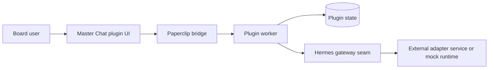

# Paperclip Master Chat Plugin

A standalone **Paperclip plugin** that adds a plugin-owned **Master Chat** surface backed by **Hermes**.

The plugin is intentionally aligned with Paperclip's current product boundary: Paperclip core remains a control plane, while rich conversational UX lives in a plugin. This repo packages the worker, UI, Hermes gateway seam, tests, and documentation needed to develop and ship that plugin as a standalone project.

## What ships in this repo

- **Plugin worker** with `getData` / `performAction` handlers for threads, scope, skills, and message sending
- **Paperclip-native UI** with a thread rail, scoped context controls, inline image attachments, dashboard widget, sidebar entry, and issue detail tab
- **Hermes integration seam** with:
  - a deterministic `mock` gateway for local development/tests
  - an `http` gateway mode for an external Hermes adapter service
- **Plugin-owned thread store** persisted via Paperclip plugin state
- **Typed multimodal payload builder** that converts message history into Hermes-friendly content blocks
- **Docs** for architecture, configuration, integration, and security
- **Tests** for payload transformation, worker behavior, and UI helpers

## Architecture summary



### Current alpha/runtime reality

Paperclip's current plugin runtime does **not** expose a stable `ctx.assets` API. To keep the plugin functional today, this repo ships **inline image attachment support** (via browser `FileReader` data URLs) and documents how to migrate to Paperclip asset persistence once the host runtime exposes that capability.

## Features

- Company-scoped thread list and chat page
- Project / issue / agent scope selection
- Skill toggles and Hermes toolset policy hints
- Inline image previews and multimodal payload packing
- Hermes tool call / tool result transcript cards
- Activity logging + metric emission on successful sends
- Dashboard widget and issue detail entry point

## Quick start

### 1) Install

```bash
pnpm install
```

### 2) Verify

```bash
pnpm verify
```

### 3) Build for Paperclip

```bash
pnpm build
```

Artifacts land in `dist/` and can be installed into a Paperclip instance as a local-path plugin during development.

## Configuration

The plugin exposes instance config fields through the Paperclip manifest schema:

- `gatewayMode`: `mock` or `http`
- `hermesBaseUrl`: base URL for an external Hermes adapter service
- `defaultProfileId`
- `defaultProvider`
- `defaultModel`
- `defaultEnabledSkills`
- `defaultToolsets`
- `availablePluginTools`
- `maxHistoryMessages`
- `allowInlineImageData`
- `enableActivityLogging`

See [`docs/configuration.md`](./docs/configuration.md).

## Hermes adapter contract

When `gatewayMode=http`, the worker POSTs a normalized payload to:

```text
POST {hermesBaseUrl}/sessions/continue
```

Expected response:

```json
{
  "assistantText": "Hermes response…",
  "toolTraces": [
    {
      "toolName": "paperclip.dashboard",
      "summary": "Prepared scoped context",
      "input": { "scope": {} },
      "output": { "ok": true }
    }
  ],
  "provider": "openrouter",
  "model": "anthropic/claude-sonnet-4",
  "sessionId": "sess_123"
}
```

See [`docs/integration.md`](./docs/integration.md) for the full payload contract.

## Repository layout

```text
src/constants.ts          plugin IDs, routes, defaults
src/types.ts              shared domain and gateway types
src/domain/store.ts       plugin-owned state store helpers
src/paperclip/context.ts  Paperclip scope/bootstrap helpers
src/hermes/*              payload builder + gateway implementations
src/worker.ts             plugin worker
src/manifest.ts           plugin manifest
src/ui/*                  plugin React UI
tests/*                   payload + worker + UI helper tests
```

## Development notes

- `mock` gateway mode is the default and keeps local tests deterministic.
- `http` mode is the production integration seam for a Hermes adapter service.
- The UI uses inline styles and self-contained React components to match Paperclip's current plugin authoring guidance.
- The repo intentionally avoids extra runtime dependencies beyond the Paperclip SDK snapshot and build tools.

## Documentation

- [Architecture](./docs/architecture.md)
- [Configuration](./docs/configuration.md)
- [Integration](./docs/integration.md)
- [Security and caveats](./docs/security.md)

## Verification

```bash
pnpm typecheck
pnpm test
pnpm build
```

## Status

This repository is production-oriented **plugin code**, but it is honest about current Paperclip alpha limitations. The worker/UI flow, thread state, Hermes payload contract, docs, and tests are complete in this repo; production rollout still depends on the target Paperclip instance and the external Hermes adapter service you wire into `gatewayMode=http`.
