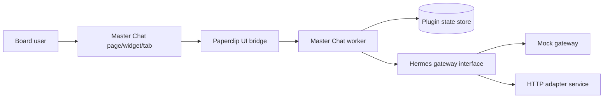

# Architecture

## Goal

Deliver a **plugin-owned master chat surface** inside Paperclip that treats Hermes as the conversational orchestrator while preserving Paperclip's strengths in scoping, auditability, and instance governance.

## Why a plugin-owned chat surface

Paperclip's product boundary is intentionally **not** "general chat everywhere." The plugin architecture is the right seam for rich conversational UX. This repo therefore keeps the feature outside core and embraces the runtime that Paperclip already exposes today:

- worker-side `getData` / `performAction`
- typed manifest capabilities
- React UI slots/pages
- plugin-owned state
- server-side bridge and streams

## Runtime topology

## Core components

### 1. Worker

The worker owns:

- thread CRUD
- skill + scope policy normalization
- Hermes request construction
- activity/metrics emission
- SSE stream events during turns
- company-scoped persistence via plugin state

### 2. UI

The UI exports:

- a full page (`/:companyPrefix/master-chat`)
- a sidebar surface linking to the page
- a dashboard widget for discovery
- an issue detail tab for issue-scoped entry

### 3. Thread store

Current Paperclip alpha supports plugin state, so this repo persists a company-scoped `MasterChatStore` object under one state key. That keeps the implementation simple and testable while avoiding unsupported host APIs.

### 4. Hermes seam

`src/hermes/gateway.ts` defines the boundary:

- `MockHermesGateway` for local dev/tests
- `HttpHermesGateway` for an external adapter service

The worker never lets the browser talk directly to Hermes.

## Message flow

1. User selects project / issue / agents / skills.
2. UI calls `send-message`.
3. Worker stores the user turn.
4. Worker loads company/project/issue/agent context.
5. Worker builds a normalized Hermes request.
6. Gateway returns assistant text + tool trace metadata.
7. Worker persists assistant message parts and emits stream events.
8. UI refreshes the thread and shows transcript/tool cards.

## Multimodal handling

Because Paperclip does not currently ship a stable `ctx.assets` API, this repo uses **inline image attachments** as the working alpha implementation:

- browser reads file as a data URL
- worker stores the attachment metadata with the message
- Hermes payload builder strips the `data:` prefix and forwards base64 content blocks

This keeps the chat actually usable today while preserving a future migration path to Paperclip asset IDs.

## Extension points for production rollout

- swap state-store persistence for a richer DB-backed repository if/when the host exposes it
- swap inline image storage for Paperclip asset IDs
- add richer tool negotiation through Paperclip plugin/tool registry endpoints
- stream structured Hermes events instead of mock sentence chunks when the adapter exposes them
