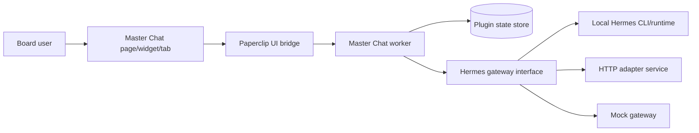

# Architecture

## Goal

Deliver a **plugin-owned master chat surface** inside Paperclip that treats Hermes as the conversational orchestrator while preserving Paperclip's strengths in scoping, auditability, and instance governance.

## Why a plugin-owned chat surface

Paperclip's product boundary is intentionally **not** "general chat everywhere." The plugin architecture is the right seam for rich conversational UX. This repo therefore keeps the feature outside core and embraces the runtime that Paperclip already exposes today:

- worker-side `getData` / `performAction`
- typed manifest capabilities
- React UI slots/pages
- plugin-owned state
- server-side bridge and streams

## Runtime topology

## Core components

### 1. Worker

The worker owns:

- thread CRUD
- skill + scope policy normalization
- filesystem-backed attachment persistence + hydration
- cached image-analysis/OCR enrichment
- Hermes request construction
- activity/metrics emission
- SSE stream events during turns
- company-scoped persistence via plugin state
- selection of the best Hermes gateway for the current environment
- typed failure normalization and retry-safe continuation

### 2. UI

The UI exports:

- a full page (`/:companyPrefix/master-chat`)
- a sidebar surface linking to the page
- a dashboard widget for discovery
- an issue detail tab for issue-scoped entry

The page now renders explicit warning/error/streaming states and disables scope edits while a turn is in flight.

### 3. Thread store

Current Paperclip alpha supports plugin state, so this repo persists a company-scoped `MasterChatStore` object under one state key. The store is schema-versioned, and image bytes are persisted separately via a filesystem attachment backend so plugin state does not need to retain large inline payloads by default.

### 4. Hermes seam

`src/hermes/gateway.ts` defines the boundary:

- `CliHermesGateway` for reusing a host-local Hermes install on the same VPS
- `HttpHermesGateway` for an external adapter service with explicit auth headers
- `MockHermesGateway` for local dev/tests

`gatewayMode=auto` now performs real gateway selection:

1. probe the local Hermes CLI
2. if unavailable, probe the HTTP adapter health endpoint
3. if neither is viable, fall back to `mock`

The worker never lets the browser talk directly to Hermes.

## Message flow

1. User selects project / issue / agents / skills.
2. UI calls `send-message` with a request ID.
3. Worker validates scope and attachment limits, computes attachment hashes, and acquires the per-thread in-flight slot.
4. Worker optionally runs Hermes-backed image analysis/OCR, reusing cached results for matching attachments already seen in the thread.
5. Worker persists attachment bytes to the local filesystem backend, stores the user turn, and loads company/project/issue/agent context with paginated catalog fetches.
6. Worker builds a normalized Hermes request aligned with the current thread tool policy and includes a synthetic continuity summary when older history is truncated.
7. Selected gateway returns assistant text + optional tool trace metadata.
8. Worker redacts tool payloads when configured, persists assistant message parts, and emits stream events.
9. UI refreshes the thread and shows transcript/tool cards.

## Multimodal handling

Because Paperclip does not currently ship a stable `ctx.assets` API, this repo uses a **filesystem-backed attachment store** plus inline transport at the bridge boundary:

- browser reads file as a data URL
- UI and worker enforce MIME and byte limits before forwarding
- worker computes a content hash, optionally runs a Hermes image-analysis pass, and persists the binary to local storage
- thread detail responses hydrate filesystem-backed images back into data URLs only when needed for rendering or Hermes payload construction
- HTTP gateway mode strips the `data:` prefix and forwards base64 content blocks plus a compact analysis fallback text block
- CLI gateway mode now has two paths:
  - a dedicated `hermes chat --image <path>` analysis turn for OCR/detail extraction
  - the main chat prompt including the cached image-analysis fallback text
- when older thread history is truncated, Hermes receives a deterministic continuity summary instead of an invented durable-memory claim

This keeps the chat actually usable today while materially reducing multimodal and persistence risk, while preserving a future migration path to Paperclip asset IDs.

## Extension points for production rollout

- swap state-store persistence for a richer DB-backed repository if/when the host exposes it
- swap inline image storage for Paperclip asset IDs
- add richer tool negotiation through Paperclip plugin/tool registry endpoints
- add a first-party Hermes adapter that preserves structured tool traces even in local-host mode
- stream structured Hermes events instead of mock sentence chunks when the adapter exposes them
