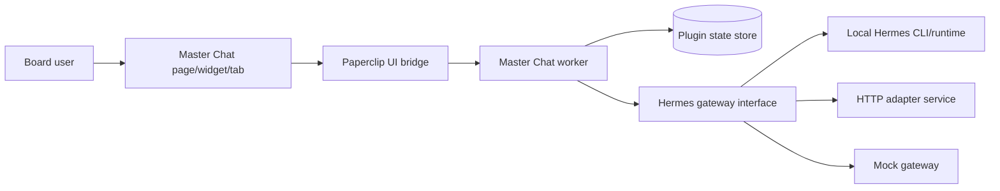

# Architecture

## Goal

Deliver a **plugin-owned master chat surface** inside Paperclip that treats Hermes as the conversational orchestrator while preserving Paperclip's strengths in scoping, auditability, and instance governance.

## Why a plugin-owned chat surface

Paperclip's product boundary is intentionally **not** "general chat everywhere." The plugin architecture is the right seam for rich conversational UX. This repo therefore keeps the feature outside core and embraces the runtime that Paperclip already exposes today:

- worker-side `getData` / `performAction`
- typed manifest capabilities
- React UI slots/pages
- plugin-owned state
- server-side bridge and streams

## Runtime topology

## Core components

### 1. Worker

The worker owns:

- thread CRUD
- skill + scope policy normalization
- Hermes request construction
- activity/metrics emission
- SSE stream events during turns
- company-scoped persistence via plugin state
- selection of the best Hermes gateway for the current environment
- typed failure normalization and retry-safe continuation

### 2. UI

The UI exports:

- a full page (`/:companyPrefix/master-chat`)
- a sidebar surface linking to the page
- a dashboard widget for discovery
- an issue detail tab for issue-scoped entry

The page now renders explicit warning/error/streaming states and disables scope edits while a turn is in flight.

### 3. Thread store

Current Paperclip alpha supports plugin state, so this repo persists a company-scoped `MasterChatStore` object under one state key. The store is now schema-versioned to make future migrations explicit.

### 4. Hermes seam

`src/hermes/gateway.ts` defines the boundary:

- `CliHermesGateway` for reusing a host-local Hermes install on the same VPS
- `HttpHermesGateway` for an external adapter service with explicit auth headers
- `MockHermesGateway` for local dev/tests

`gatewayMode=auto` now performs real gateway selection:

1. probe the local Hermes CLI
2. if unavailable, probe the HTTP adapter health endpoint
3. if neither is viable, fall back to `mock`

The worker never lets the browser talk directly to Hermes.

## Message flow

1. User selects project / issue / agents / skills.
2. UI calls `send-message` with a request ID.
3. Worker validates scope and attachment limits, stores the user turn, and acquires the per-thread in-flight slot.
4. Worker loads company/project/issue/agent context with paginated catalog fetches.
5. Worker builds a normalized Hermes request aligned with the current thread tool policy.
6. Selected gateway returns assistant text + optional tool trace metadata.
7. Worker redacts tool payloads when configured, persists assistant message parts, and emits stream events.
8. UI refreshes the thread and shows transcript/tool cards.

## Multimodal handling

Because Paperclip does not currently ship a stable `ctx.assets` API, this repo uses **inline image attachments** as the working alpha implementation:

- browser reads file as a data URL
- UI and worker enforce MIME and byte limits before forwarding
- worker stores the attachment metadata with the message
- HTTP gateway mode strips the `data:` prefix and forwards base64 content blocks
- CLI gateway mode forwards image metadata in the prompt so the local Hermes agent still receives attachment context even when the CLI path is text-first

This keeps the chat actually usable today while preserving a future migration path to Paperclip asset IDs.

## Extension points for production rollout

- swap state-store persistence for a richer DB-backed repository if/when the host exposes it
- swap inline image storage for Paperclip asset IDs
- add richer tool negotiation through Paperclip plugin/tool registry endpoints
- add a first-party Hermes adapter that preserves structured tool traces even in local-host mode
- stream structured Hermes events instead of mock sentence chunks when the adapter exposes them
