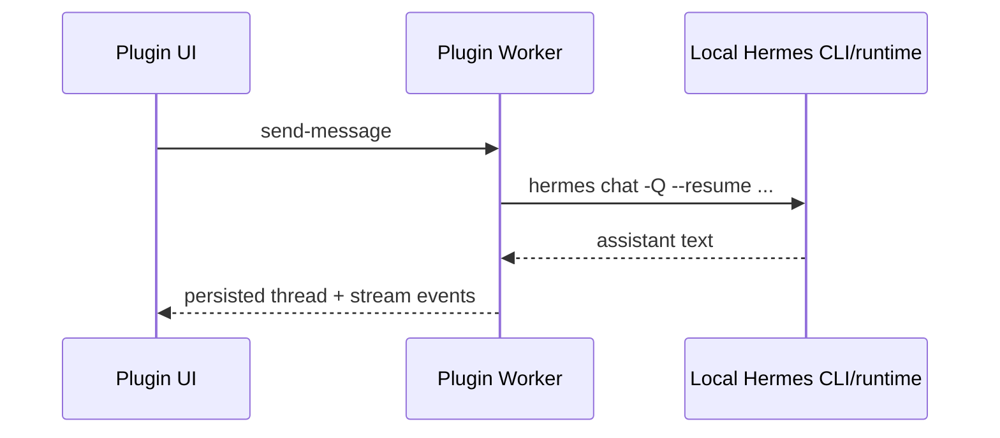
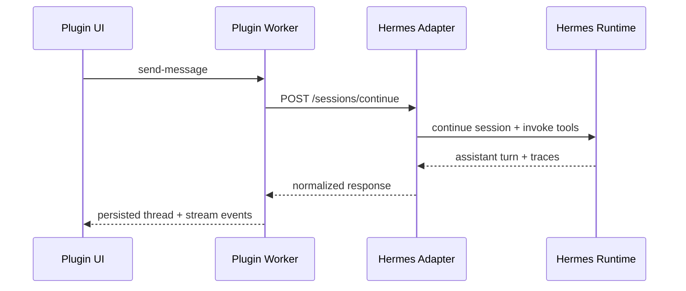

# Integration

## Supported Hermes integration modes

### 1. Local CLI/runtime reuse (`gatewayMode=auto` or `gatewayMode=cli`)

This is the preferred path on a single VPS that already has Hermes installed.

The worker shells out to the configured Hermes binary and passes:

- the chosen Hermes profile (`-p <profile>`)
- provider override (`--provider`)
- model override (`-m`)
- `--resume <sessionId>` when a durable Hermes session is already known
- a normalized Paperclip-aware prompt assembled from thread scope and history, with unsupported Hermes skills/toolsets filtered out automatically after probing the host install

Representative invocation:

```bash
hermes -p default chat -Q --source tool \
  --provider auto \
  -m MiniMax-M2.7 \
  --resume sess_existing_optional \
  -q "<normalized Paperclip scope + history prompt>"
```

This mode reuses the **existing Hermes agent installation on the host** instead of requiring a separate adapter service.

### Session continuity semantics

- Existing CLI-backed threads reuse `sessionId` with `--resume`.
- New CLI-backed threads start `stateless`, but are upgraded to `durable` automatically once Hermes returns a real session ID.
- HTTP-backed threads also upgrade to `durable` automatically whenever the adapter returns a real `sessionId`, even if the adapter omits `continuationMode`.
- HTTP mode remains the preferred path for production-grade durable continuation.

### 2. External HTTP adapter (`gatewayMode=http`)

The plugin's alternative production seam is an HTTP adapter service.

#### Request

```http
POST /sessions/continue
content-type: application/json
authorization: Bearer <token>
```

Request body shape:

```json
{
  "session": {
    "profileId": "default",
    "sessionId": "sess_existing_optional",
    "model": "MiniMax-M2.7",
    "provider": "auto"
  },
  "metadata": {
    "threadId": "thr_123",
    "title": "CTO alignment"
  },
  "scope": {
    "companyId": "comp_123",
    "projectId": "proj_456",
    "linkedIssueId": "iss_789",
    "selectedAgentIds": ["agt_cto"],
    "mode": "single_agent"
  },
  "skillPolicy": {
    "enabled": [],
    "disabled": [],
    "toolsets": ["web", "file", "vision"]
  },
  "toolPolicy": {
    "allowedPluginTools": ["paperclip.dashboard"],
    "allowedHermesToolsets": ["web", "file", "vision"]
  },
  "context": {
    "company": { "id": "comp_123", "name": "Acme" },
    "project": { "id": "proj_456", "name": "Core App" },
    "linkedIssue": { "id": "iss_789", "name": "Launch risk" },
    "selectedAgents": [{ "id": "agt_cto", "name": "CTO" }],
    "issueCount": 12,
    "agentCount": 4,
    "projectCount": 3,
    "catalog": {
      "companies": { "loaded": 1, "pageSize": 200, "truncated": false },
      "projects": { "loaded": 3, "pageSize": 200, "truncated": false },
      "issues": { "loaded": 12, "pageSize": 200, "truncated": false },
      "agents": { "loaded": 4, "pageSize": 200, "truncated": false }
    },
    "warnings": []
  },
  "tools": [
    {
      "name": "paperclip.dashboard",
      "description": "Allowed Paperclip/plugin tool: paperclip.dashboard",
      "kind": "paperclip"
    }
  ],
  "messages": [
    {
      "role": "user",
      "content": [
        { "type": "text", "text": "Compare delivery risk." },
        { "type": "image", "mimeType": "image/png", "data": "<base64>" }
      ]
    }
  ]
}
```

### 3. Bundled local adapter service

This repo now ships a small Node-based adapter service at `dist/adapter-service.js`.

It is useful when you want:

- the stronger process boundary of HTTP mode,
- auth-protected plugin-to-adapter traffic,
- host-local reuse of the already installed Hermes CLI,
- richer structured metadata than the direct CLI path.

Start it like this:

```bash
MASTER_CHAT_ADAPTER_TOKEN=change-me \
MASTER_CHAT_HERMES_COMMAND=/usr/local/bin/hermes \
MASTER_CHAT_HERMES_CWD=/root/hermes-agent \
MASTER_CHAT_ADAPTER_DEFAULT_PROFILE=default \
MASTER_CHAT_ADAPTER_DEFAULT_PROVIDER=auto \
MASTER_CHAT_ADAPTER_DEFAULT_MODEL=MiniMax-M2.7 \
pnpm adapter:start
```

Set the `MASTER_CHAT_ADAPTER_DEFAULT_*` variables to the same profile/provider/model defaults used by the plugin when the adapter is reusing the same host Hermes install. That avoids re-forcing CLI flags that the local profile already covers.

The service exposes:

- `GET /health`
- `POST /sessions/continue`

#### Response

```json
{
  "assistantText": "Hermes response…",
  "toolTraces": [
    {
      "toolName": "paperclip.dashboard",
      "summary": "Prepared scoped context",
      "input": { "scope": { "companyId": "comp_123" } },
      "output": { "ok": true }
    }
  ],
  "provider": "auto",
  "model": "MiniMax-M2.7",
  "sessionId": "sess_new_or_existing",
  "gatewayMode": "http",
  "continuationMode": "durable"
}
```

## Adapter responsibilities

The external adapter service should:

1. Continue or create Hermes sessions.
2. Translate plugin-provided scope and tools into Hermes system/context prompts.
3. Route multimodal blocks to Hermes in the form expected by the target provider.
4. Filter unsupported Hermes skills/toolsets against the host runtime before passing `-s/-t`.
5. Return normalized text + tool traces.
6. Expose health checks because `gatewayMode=auto` now uses adapter health to decide fallback behavior.
7. Support trusted-host deployments explicitly. This repo now uses direct Node `fetch` automatically for loopback adapter URLs on the same VPS, because Paperclip's guarded `ctx.http.fetch` correctly blocks private ranges. Non-loopback RFC1918/private adapter URLs require explicit `allowPrivateAdapterHosts=true`.
8. Require secure remote transport by default. Non-loopback adapter URLs must use `https` unless the operator explicitly sets `allowInsecureHttpAdapters=true`.
9. Enforce a maximum request body size. The bundled adapter defaults to `MASTER_CHAT_ADAPTER_MAX_BODY_BYTES=15000000` and returns `413` when callers exceed it.
10. Verify signed requests. The worker now sends `x-master-chat-date`, `x-master-chat-nonce`, and `x-master-chat-signature` headers; the bundled adapter rejects stale or replayed signatures using the shared adapter secret as the HMAC key.
11. Enforce adapter auth in a side-channel-resistant way.

## Paperclip runtime considerations

- The worker persists thread state through `ctx.state` with a schema version.
- UI calls use the built-in plugin bridge only.
- The browser never needs Hermes secrets or direct provider access.
- Scope selectors are loaded paginated and now surface truncation warnings instead of silently hiding records.
- Retry re-runs only the failed assistant continuation; it does not create a new user turn.
- Worker config updates are validated before apply, so invalid adapter URLs or missing auth fail early instead of breaking the next live turn.

## Suggested deployment shapes

### Same VPS reuse



### External adapter boundary


