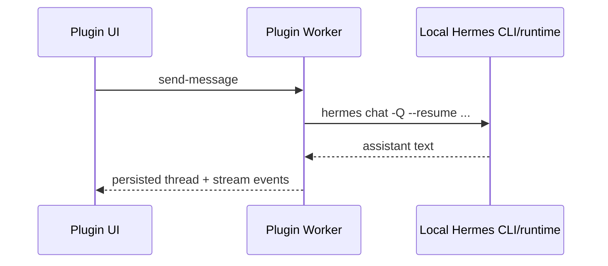
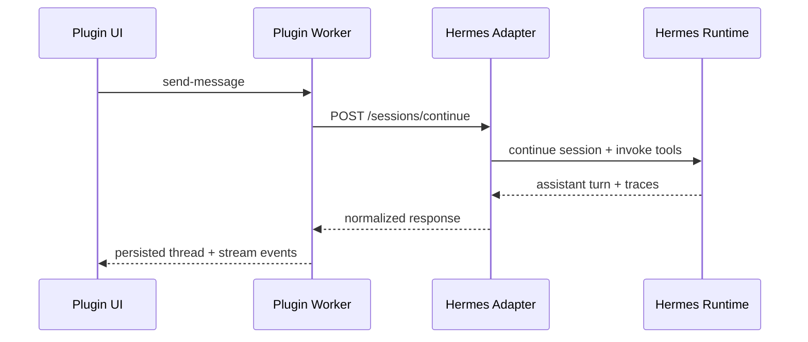

# Integration

## Supported Hermes integration modes

### 1. Local CLI/runtime reuse (`gatewayMode=auto` or `gatewayMode=cli`)

This is the preferred path on a single VPS that already has Hermes installed.

The worker shells out to the configured Hermes binary and passes:

- the chosen Hermes profile (`-p <profile>`)
- provider override (`--provider`)
- model override (`-m`)
- enabled toolsets (`-t`)
- enabled skills (`-s`)
- `--resume <sessionId>` when a durable Hermes session is already known
- a normalized Paperclip-aware prompt assembled from thread scope and history

Representative invocation:

```bash
hermes -p paperclip-master chat -Q --source tool \
  --provider openrouter \
  -m anthropic/claude-sonnet-4 \
  --resume sess_existing_optional \
  -t web,file,paperclip-context \
  -s paperclip-search,issue-summarize \
  -q "<normalized Paperclip scope + history prompt>"
```

This mode reuses the **existing Hermes agent installation on the host** instead of requiring a separate adapter service.

### Session continuity semantics

- Existing CLI-backed threads reuse `sessionId` with `--resume`.
- New CLI-backed threads are treated as `stateless` until a real Hermes session ID can be proven.
- HTTP mode remains the preferred path for production-grade durable continuation.

### 2. External HTTP adapter (`gatewayMode=http`)

The plugin's alternative production seam is an HTTP adapter service.

#### Request

```http
POST /sessions/continue
content-type: application/json
authorization: Bearer <token>
```

Request body shape:

```json
{
  "session": {
    "profileId": "paperclip-master",
    "sessionId": "sess_existing_optional",
    "model": "anthropic/claude-sonnet-4",
    "provider": "openrouter"
  },
  "metadata": {
    "threadId": "thr_123",
    "title": "CTO alignment"
  },
  "scope": {
    "companyId": "comp_123",
    "projectId": "proj_456",
    "linkedIssueId": "iss_789",
    "selectedAgentIds": ["agt_cto"],
    "mode": "single_agent"
  },
  "skillPolicy": {
    "enabled": ["paperclip-search", "issue-summarize"],
    "disabled": [],
    "toolsets": ["web", "paperclip-context"]
  },
  "toolPolicy": {
    "allowedPluginTools": ["paperclip.dashboard"],
    "allowedHermesToolsets": ["web", "paperclip-context"]
  },
  "context": {
    "company": { "id": "comp_123", "name": "Acme" },
    "project": { "id": "proj_456", "name": "Core App" },
    "linkedIssue": { "id": "iss_789", "name": "Launch risk" },
    "selectedAgents": [{ "id": "agt_cto", "name": "CTO" }],
    "issueCount": 12,
    "agentCount": 4,
    "projectCount": 3,
    "catalog": {
      "companies": { "loaded": 1, "pageSize": 200, "truncated": false },
      "projects": { "loaded": 3, "pageSize": 200, "truncated": false },
      "issues": { "loaded": 12, "pageSize": 200, "truncated": false },
      "agents": { "loaded": 4, "pageSize": 200, "truncated": false }
    },
    "warnings": []
  },
  "tools": [
    {
      "name": "paperclip.dashboard",
      "description": "Allowed Paperclip/plugin tool: paperclip.dashboard",
      "kind": "paperclip"
    }
  ],
  "messages": [
    {
      "role": "user",
      "content": [
        { "type": "text", "text": "Compare delivery risk." },
        { "type": "image", "mimeType": "image/png", "data": "<base64>" }
      ]
    }
  ]
}
```

#### Response

```json
{
  "assistantText": "Hermes response…",
  "toolTraces": [
    {
      "toolName": "paperclip.dashboard",
      "summary": "Prepared scoped context",
      "input": { "scope": { "companyId": "comp_123" } },
      "output": { "ok": true }
    }
  ],
  "provider": "openrouter",
  "model": "anthropic/claude-sonnet-4",
  "sessionId": "sess_new_or_existing",
  "gatewayMode": "http",
  "continuationMode": "durable"
}
```

## Adapter responsibilities

The external adapter service should:

1. Continue or create Hermes sessions.
2. Translate plugin-provided scope and tools into Hermes system/context prompts.
3. Route multimodal blocks to Hermes in the form expected by the target provider.
4. Return normalized text + tool traces.
5. Expose health checks because `gatewayMode=auto` now uses adapter health to decide fallback behavior.

## Paperclip runtime considerations

- The worker persists thread state through `ctx.state` with a schema version.
- UI calls use the built-in plugin bridge only.
- The browser never needs Hermes secrets or direct provider access.
- Scope selectors are loaded paginated and now surface truncation warnings instead of silently hiding records.
- Retry re-runs only the failed assistant continuation; it does not create a new user turn.

## Suggested deployment shapes

### Same VPS reuse



### External adapter boundary


